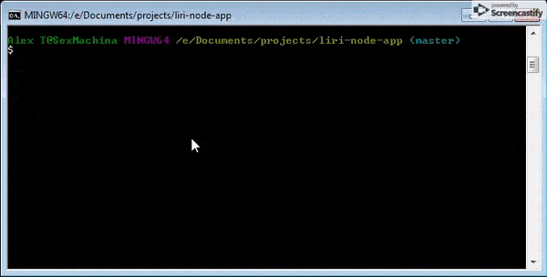
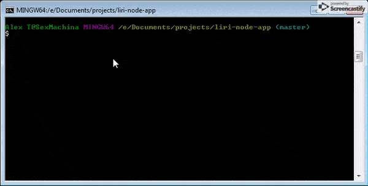
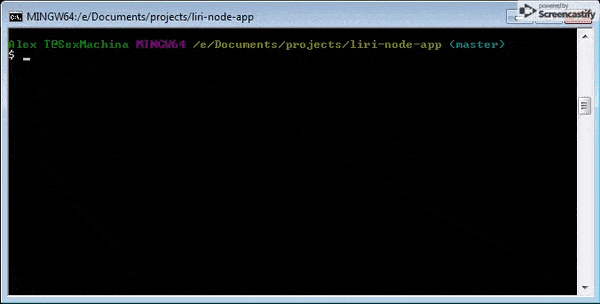
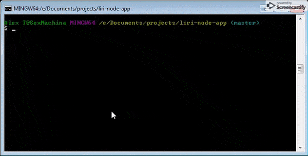

# LIRI Bot

### Overview

LIRI is like iPhone's SIRI. However, while SIRI is a Speech Interpretation and Recognition Interface, LIRI is a _Language_ Interpretation and Recognition Interface. LIRI will is a command line node app that takes in parameters and gives you back data.

Demo: https://drive.google.com/file/d/1pmoofntCGo7EMx0SEq1LoIPaimJ5X-mZ/view?usp=sharing

### What Each Command Will Do

Once you navigate to the directory for the app you can type in the following 4 commands:

* `node liri.js concert-this <artist/band name here>`

   * This will search the Bands in Town Artist Events API for an artist and render the following information about each event to the terminal:

     * Name of the venue

     * Venue location

     * Date of the Event (use moment to format this as "MM/DD/YYYY")

    

* `node liri.js movie-this '<movie name here>'`

   * This will output the following information to your terminal:

     ```
       * Title of the movie.
       * Year the movie came out.
       * IMDB Rating of the movie.
       * Rotten Tomatoes Rating of the movie.
       * Country where the movie was produced.
       * Language of the movie.
       * Plot of the movie.
       * Actors in the movie.
     ```

   * If the no movie is typed in, data will be outputted for the movie 'Mr. Nobody.'

   

* `node liri.js spotify-this-song '<song name here>'`

   * This will show the following information about the song in your terminal/bash window

     * Artist(s)

     * The song's name

     * A preview link of the song from Spotify

     * The album that the song is from

   * If no song is provided then LIRI will search for "The Sign" by Ace of Base.

   * To use the "spotify-this-song" feature you must provide your own Spotify API keys and create a file named `.env`, with the following in it, replacing the values with your API keys (no quotes):

    ```js
    # Spotify API keys

    SPOTIFY_ID=your-spotify-id
    SPOTIFY_SECRET=your-spotify-secret

    ```

   * The Spotify API requires you sign up as a developer to generate the necessary credentials. You can follow these steps in order to generate a **client id** and **client secret**:

   * Step One: Visit <https://developer.spotify.com/my-applications/#!/>

   * Step Two: Either login to your existing Spotify account or create a new one (a free account is fine) and log in.

   * Step Three: Once logged in, navigate to <https://developer.spotify.com/my-applications/#!/applications/create> to register a new application to be used with the Spotify API. You can fill in whatever you'd like for these fields. When finished, click the "complete" button.

   * Step Four: On the next screen, scroll down to where you see your client id and client secret. Copy these values down somewhere, you'll need them to use the Spotify API

   

* `node liri.js do-what-it-says`

   * LIRI will take the text inside of random.txt and then use it to call one of LIRI's commands.

    * You can edit the text in random.txt to perform a different function however you must type a command first, then a comma, then the value with no space following the comma: 
    `<command>,<value>`

    

### Other Features

Everything command you pass to LIRI will be logged in a 'log.txt' file along with the results of the command which you can reference so see past searches or potential bugs in the application